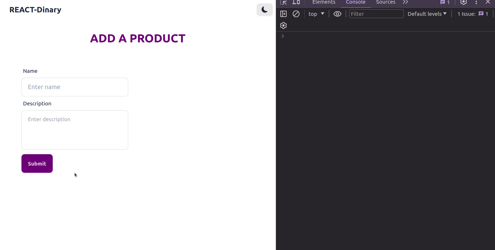
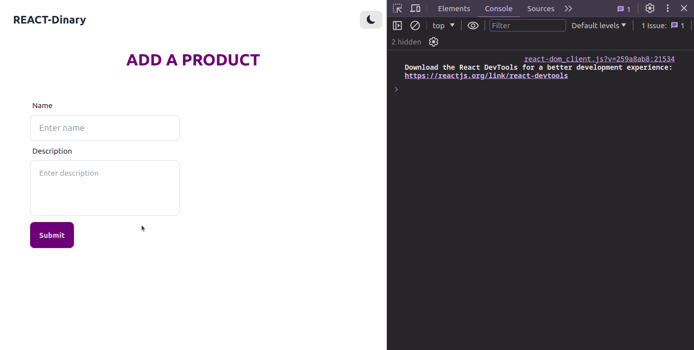
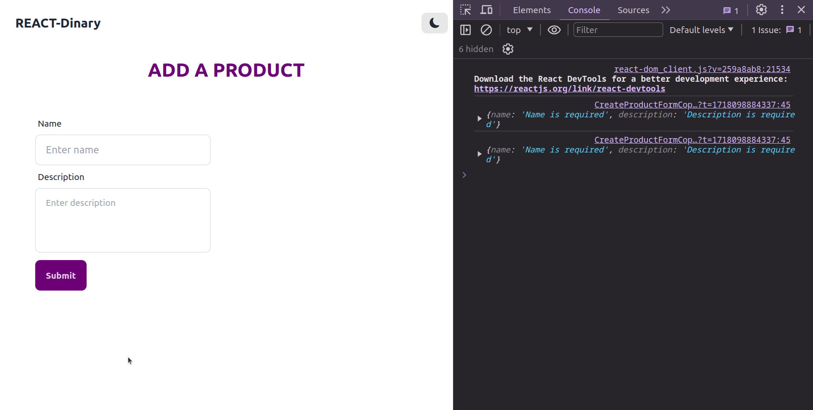

# Frontend Schritte 1

- Der Frontend wird mit `React-Vite`, `Tailwind CSS` und `DaisyUI` erstellt
- Der Frontend stellt eine Formular bereit, um ein neues Produkt zu erstellen

## Projekt erstellen

**Schritt 1: Projekt Initialisieren**

- **OUSERHALB** des Backend-Projekts, in deinem **MUTTER-ordner**, starte ein neues React-Projekt mit Vite:

```bash
npm create vite@latest
```

**BRAUCHST DU WIEDERHOLUNG? [BESUCH MAL "THE DOCS](https://vitejs.dev/guide/)"**

- Wähle die Optionen die zu deinem Projekt passen

**Schritt 2: Tailwind CSS und DaisyUI installieren**

- Installiere Tailwind CSS und DaisyUI:

```bash
npm install -D tailwindcss postcss autoprefixer
npx tailwindcss init -p
npm i -D daisyui@latest
```

**TAILWIND DOCS [SIND HIER](https://tailwindcss.com/docs/guides/vite)**
**DAISYUI DOCS [SIND HIER](https://daisyui.com/docs/install/)**

**Schritt 3: Konfiguration**

- Füge folgenden Code in die `tailwind.config.js`-Datei ein:

```javascript
/** @type {import('tailwindcss').Config} */
export default {
  content: ["./index.html", "./src/**/*.{js,ts,jsx,tsx}"],
  theme: {
    extend: {},
  },
  plugins: [require("daisyui")],
};
```

- Füge folgenden Code in die `postcss.config.js`-Datei ein:

```javascript
export default {
  plugins: {
    tailwindcss: {},
    autoprefixer: {},
  },
};
```

- Dein `index.css`-Datei sollte so aussehen:

```css
@tailwind base;
@tailwind components;
@tailwind utilities;
```

- Zum schluß, sollte dein `package.json`-Datei ungefähr so aussehen:

```json
{
  "name": "cloudinary-frontend",
  "private": true,
  "version": "1.0.0",
  "description": "Frontend with React-Vite, Tailwind CSS and DaisyUI",
  "type": "module",
  "scripts": {
    "dev": "vite",
    "build": "vite build",
    "lint": "eslint . --ext js,jsx --report-unused-disable-directives --max-warnings 0",
    "preview": "vite preview"
  },
  "dependencies": {
    "react": "^18.2.0",
    "react-dom": "^18.2.0"
  },
  "devDependencies": {
    "@types/react": "^18.2.64",
    "@types/react-dom": "^18.2.21",
    "@vitejs/plugin-react": "^4.2.1",
    "autoprefixer": "^10.4.18",
    "daisyui": "^4.7.3",
    "eslint": "^8.57.0",
    "eslint-plugin-react": "^7.34.0",
    "eslint-plugin-react-hooks": "^4.6.0",
    "eslint-plugin-react-refresh": "^0.4.5",
    "postcss": "^8.4.35",
    "prettier": "^3.3.1",
    "prettier-plugin-tailwindcss": "^0.6.1",
    "tailwindcss": "^3.4.1",
    "vite": "^5.1.6"
  }
}
```

- Vergiss nicht, `npm install` auszuführen, um die Abhängigkeiten zu installieren

**Schritte 4: Navkomponenten erstellen (optional)**

- Erstelle ein `components`- Ornder in dein `src`- Ordner
- Erstelle eine `NavComponent.jsx`- Datei in dein `components`- Ordner und bau eine einfache FunktionalKomponent auf. z.B:

```jsx
const NavComponent = () => {
  return (
    <div className="navbar bg-base-100 py-3 lg:px-20">
      <div className="navbar-start">
        <a className="btn btn-ghost text-xl">REACT-Dinary</a>
      </div>
    </div>
  );
};
export default NavComponent;
```

- importiere die `NavComponent` in dein `App.jsx`- Datei und verwende sie:

```jsx
import NavComponent from "./components/NavComponent";

const App = () => {
  return (
    <div>
      <NavComponent />
    </div>
  );
};
export default App;
```

- vergiss nicht, die Anwendung zu starten und zu überprüfen, ob die Komponente angezeigt wird
- Lösche die `app.css`-Datei (du brauchst sie nicht mehr ... ODER?)

**Schritt 5: Formular erstellen**

- Erstelle ein `CreateProduct.jsx`- Datei in dein `src`- Ordner
- Erstelle eine FunktionalKomponent mit einem Formular, um ein neues Produkt zu erstellen.
- Die Formular soll folgende Felder haben:

  - `Name` (Name des Produkts)
  - `Description` (Beschreibung des Produkts)

- z.B:

```jsx
const CreateProduct = () => {
  return (
    <div className="p-10">
      <form>
        <div className="form-control">
          <label className="label">
            <span className="label-text">Name</span>
          </label>
          <input
            type="text"
            placeholder="Name"
            className="input input-bordered"
          />
        </div>
        <div className="form-control">
          <label className="label">
            <span className="label-text">Description</span>
          </label>
          <textarea
            placeholder="Description"
            className="textarea textarea-bordered"></textarea>
        </div>
        <button className="btn btn-primary">Create Product</button>
      </form>
    </div>
  );
};
```

- importiere die `CreateProduct` in dein `App.jsx`- Datei und verwende sie:

```jsx
//... andere Imports
import CreateProduct from "./CreateProduct";

const App = () => {
  return (
    <div>
      <NavComponent />
      <div className="container mx-auto p-5 lg:w-2/3 lg:p-2">
        <CreateProductForm />
      </div>
    </div>
  );
};
```

- Starte die Anwendung und überprüfe, ob das Formular angezeigt wird

**Schritt 6: Formular-Logik hinzufügen in CreateProduct.jsx**

- Erstelle alle notwendigen `useState`-Hooks, um die Formulardaten zu verwalten
- Erstelle alle notwendigen Funktionen, um die Formulardaten zu verarbeiten und in die Konsole zu loggen

```jsx
import { useState } from "react";

const CreateProductFormCopy = () => {
  const [name, setName] = useState("");
  const [description, setDescription] = useState("");

  // Handle form input changes
  const handleChange = (e) => {
    const { id, value } = e.target;
    if (id === "name") {
      setName(value);
    } else if (id === "description") {
      setDescription(value);
    }
  };

  const handleFormSubmit = async (e) => {
    e.preventDefault();

    const productData = {
      name,
      description,
    };
    console.log("Form data: ", productData); // log the form data

    // Clear the form
    setName("");
    setDescription("");
  };

  return (
    <>
      <h1 className="mb-12 text-center text-3xl font-bold uppercase text-primary">
        Add a Product
      </h1>
      <form onSubmit={handleFormSubmit} className="m-x-auto w-full">
        <div className="flex flex-col gap-8 sm:flex-row lg:gap-16">
          <div className="lg:w-1/2">
            <div className="form-control w-full">
              <label className="label" htmlFor="name">
                <span className="label-text">Name</span>
              </label>
              <input
                type="text"
                id="name"
                className="input input-bordered w-full"
                placeholder="Enter name"
                value={name}
                onChange={handleChange}
              />
            </div>

            <div className="form-control w-full">
              <label className="label" htmlFor="description">
                <span className="label-text">Description</span>
              </label>
              <textarea
                id="description"
                className="textarea textarea-bordered w-full resize-none"
                placeholder="Enter description"
                rows={3}
                value={description}
                onChange={handleChange}></textarea>
            </div>
          </div>
        </div>

        <button type="submit" className="btn btn-primary mt-3">
          Submit
        </button>
      </form>
    </>
  );
};

export default CreateProductFormCopy;
```

- Starte die Anwendung und überprüfe, ob das Formular funktioniert
  <video controls src="assets/form-demo1.mp4" title="Form Demo 1"></video>

**Schritt 7: Form Validation hinzufügen**

- In der jetzigen Form,

  - wenn du das Formular ohne Daten ausfüllst und auf `Submit` klickst, wird das Formular trotzdem gesendet
    

- Die Benutzer sollten gewarnt werden, wenn sie das Formular ohne Daten ausfüllen
- Erstelle ein `errors`-State, um die Fehlermeldungen zu speichern

```jsx
//... andere Imports

//... andere State Hooks
const [errors, setErrors] = useState({});
```

- Erselle eine Funktion, um die Formulardaten zu validieren

```jsx
//Form validation
const validateForm = () => {
  const newErrors = {};
  if (!name) newErrors.name = "Name is required";
  if (!description) newErrors.description = "Description is required";
  return newErrors;
};
```

**Erklarung:**

- Die Funktion sollte so erstellt werden, dass sie:
  - nur eine Aufgabe erfüllt
  - leicht zu testen ist
  - leicht zu warten ist
  - nur das schreibt, was wir brauchen
- Die Funktion `validateForm` überprüft, ob die `name` und `description` Felder leer sind
- Wenn ein Feld leer ist, wird ein Fehler für das entsprechende Feld in den `newErrors`-Objekt hinzugefügt
- Die Funktion gibt das `newErrors`-Objekt zurück
- Dass heißt, die Funktion hast nur eine Aufgabe: Überprüfen, ob ein Feld leer ist und einen Fehler in den `newErrors`-Objekt hinzufügen. Vertig!

- Füge die `validateForm`-Funktion in die `handleFormSubmit`-Funktion hinzu

```jsx
const handleFormSubmit = async (e) => {
  const newErrors = validateForm(e);
  if (Object.keys(newErrors).length > 0) {
    console.log(newErrors);
    setErrors(newErrors);
    return;
  }

  // Clear the form
  setName("");
  setDescription("");
};
```



- Modifiziere die `handleChange`-Funktion, um die Fehlermeldungen zu löschen, wenn der Benutzer die Eingabe korrigiert

```jsx
const handleChange = (e) => {
  const { id, value } = e.target;
  if (id === "name") {
    setName(value);
    setErrors({ ...errors, name: "" });
  } else if (id === "description") {
    setDescription(value);
    setErrors({ ...errors, description: "" });
  }
};
```

- füge die Fehlermeldungen in die Formularfelder hinzu wenn ein Fehler auftritt ( errinerst du dich noch an das `conditional rendering`?)
- diese Fehlermeldungen sollten nur angezeigt werden, wenn ein Fehler auftritt
- es sollte unterhalb des Formularfeldes angezeigt werden. Das heißt, unter den `input`- oder `textarea`-Feldern, VOR dem schließen des `div`-Tags
- z.b: für das `name`-Feld:

```jsx
<div className="form-control w-full">
  <label className="label" htmlFor="name">
    <span className="label-text">Name</span>
  </label>
  <input
    type="text"
    id="name"
    className="input input-bordered w-full"
    placeholder="Enter name"
    value={name}
    onChange={handleChange}
  />
  {errors.name && <p className="mt-1 text-xs text-red-500">{errors.name}</p>}
</div>
```

- leider geht die Fehlermeldung nicht weg, wenn der Benutzer die Eingabe korrigiert.



- um das Problem zu lösen, füge die `setErrors`-Funktion in die `handleChange`-Funktion hinzu

```jsx
// Formularfelder behandeln
const handleChange = (e) => {
  const { id, value } = e.target;
  if (id === "name") {
    setName(value);

    // Fehlermeldung löschen, wenn der Benutzer die Eingabe korrigiert
    if (value) setErrors((prevErrors) => ({ ...prevErrors, name: null }));
  } else if (id === "description") {
    setDescription(value);

    // Fehlermeldung löschen, wenn der Benutzer die Eingabe korrigiert
    if (value)
      setErrors((prevErrors) => ({ ...prevErrors, description: null }));
  }
};
```

- Starte die Anwendung und überprüfe, ob die Fehlermeldungen korrekt angezeigt werden und verschwinden, wenn der Benutzer die Eingabe korrigiert



- Unser Formular ist jetzt funktionsfähig und validiert die Eingaben des Benutzers
- Wir haben auch die `SOLID`-Prinzipien befolgt, indem wir:
  - `S`: Single Responsibility Principle - Eine Funktion/Komponente sollte nur eine Aufgabe erfüllen
  - `O`: Open/Closed Principle - Eine Funktion/Komponente sollte offen für Erweiterungen, aber geschlossen für Änderungen sein
  - `I`: Interface Segregation Principle - Eine Funktion/Komponente sollte nur die Methoden enthalten, die sie benötigt
- Wir haben auch das `DRY`-Prinzip befolgt, indem wir Code Duplikation vermieden haben
- Jetzt können wir die Daten an das Backend senden, um sie in der Datenbank zu speichern!

**Schritt 8: Daten an das Backend senden**

- Wir könnten `axios` verwenden, aber wir werden `fetch` verwenden, um die Daten an das Backend zu senden
- Erstelle eine Variable, um die Backend-URL zu speichern

```jsx
const backendUrl = "http://localhost:DEINEPORTNUMMER"; // achte darauf, dass die URL zu deinem Backend passt (z.B. die Portnummer)
```

- Erstelle eine asynchrone Funktion, um die Daten an das Backend zu senden
  - verwende die `fetch`-API, um die Daten an das Backend zu senden
  - verwende `try...catch`-Block, um Fehler zu behandeln
  - die Funktion sollte die Daten zurückgeben, die vom Backend gesendet werden

```jsx
const handlePostData = async (url, data) => {
  try {
    const response = await fetch(`${url}/products`, {
      method: "POST",
      headers: {
        "Content-Type": "application/json",
      },
      body: JSON.stringify(data),
    });
    const responseData = await response.json();
    return responseData;
  } catch (error) {
    console.log(error);
  }
};
```

- Füge die `handlePostData`-Funktion in die `handleFormSubmit`-Funktion hinzu

```jsx
const handleFormSubmit = async (e) => {
  e.preventDefault();

  const newErrors = validateForm(e);
  if (Object.keys(newErrors).length > 0) {
    console.log(newErrors);
    setErrors(newErrors);
    return;
  }

  const productData = {
    name,
    description,
  };

  const responseData = await handlePostData(backendUrl, productData);
  console.log("Response data: ", responseData);

  // Clear the form
  setName("");
  setDescription("");
};
```

- Starte die Anwendung und überprüfe, ob die Daten an das Backend gesendet werden
- Überprüfe auch, ob die Daten in der Datenbank gespeichert werden
- In die Konsole solltest du die Daten sehen, die vom Backend gesendet werden
- Du kannst der `message` von der `Response`-Objekt verwenden, um die Benutzer zu informieren, ob die Daten erfolgreich gespeichert wurden oder nicht

**Schritt 9: Benutzerfreundlichkeit hinzufügen**

- Wir können die Benutzerfreundlichkeit verbessern, indem wir:
  - eine Ladeanzeige hinzufügen, während die Daten gesendet werden
  - eine Erfolgsmeldung anzeigen, wenn die Daten erfolgreich gesendet wurden
  - eine Fehlermeldung anzeigen, wenn ein Fehler auftritt
- Aber wir können erstmal ein `Message` an wenn die Daten erfolgreich gesendet wurden
- Erstellen eine `message`-State, um die Nachricht zu speichern

```jsx
//... andere State Hooks
const [message, setMessage] = useState("");
```

- Füge die `message`-State in die `handleFormSubmit`-Funktion hinzu

```jsx
const handleFormSubmit = async (e) => {
  //... andere Code
  const responseData = await handlePostData(backendUrl, productData);
  console.log("Response data: ", responseData);

  // Set the message
  setMessage(responseData.message);

  // Clear the form
  setName("");
  setDescription("");
};
```

- such dir eine geeignete Stelle, um die `message` anzuzeigen. z.B: unterhalb des Titels

```jsx
<>
  <h1 className="mb-12 text-center text-3xl font-bold uppercase text-primary">
    Add a Product
  </h1>
  {message && (
    <p className="mt-3 text-xs font-bold text-green-500">{message}</p>
  )}
</>
```
